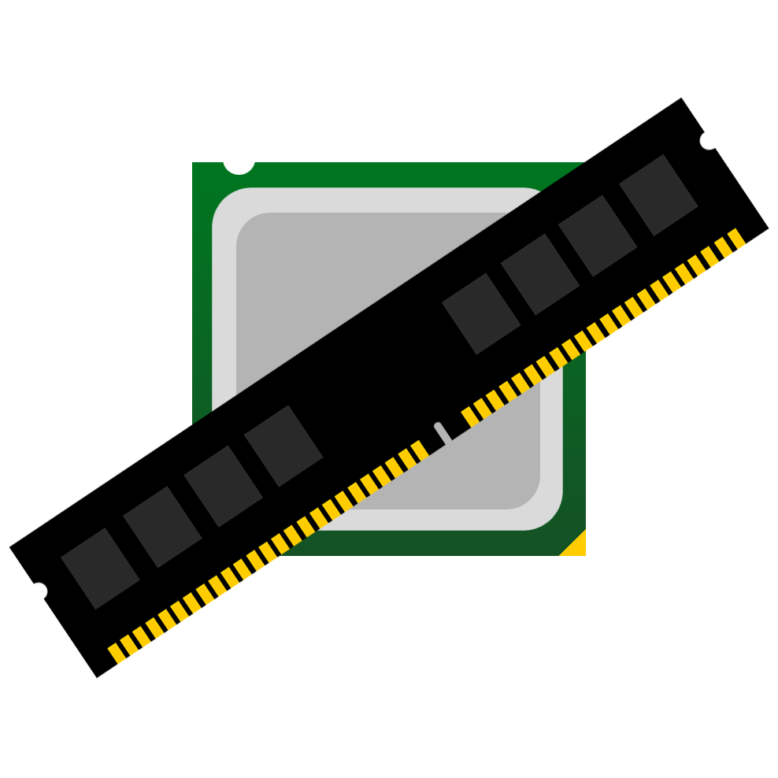
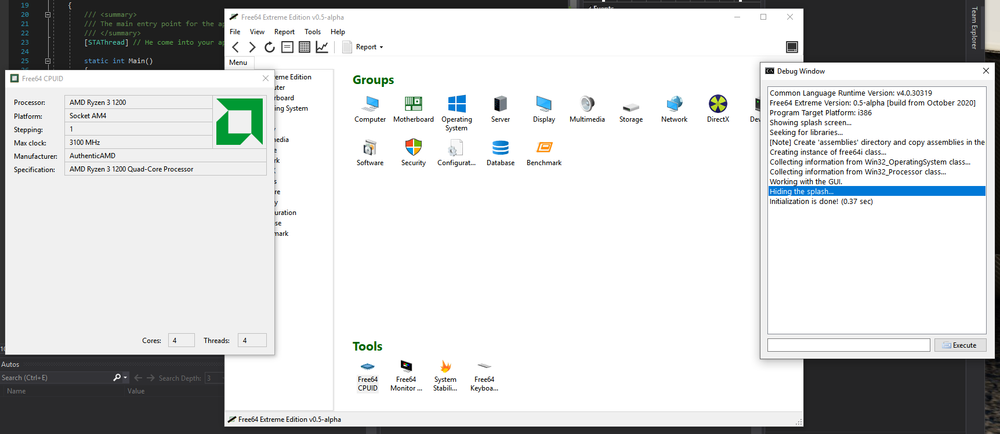

## Free64 Extreme Edition
**Free64** — open source program, that displays information about your computer. But now Free64 will working on *.NET C#* and *Windows Forms*. And now it published under [MIT Licence](LICENSE).

### Frequently Asked Questions (FAQ)

#### Where releases?
:computer: I'm now writing **First Alpha Version** (**0.5-alpha**)

#### Why first release starts from 0.5-alpha?
Because **Last Version** of PHP Free64 is **0.4-beta**

#### Where download previous PHP Versions of Free64?
:floppy_disk: **PHP Devel Studio** versions of *Free64* can be found *[here](https://github.com/emil0911/free64)*. These versions are **deprecated**.

#### What are the requirements?
  - Windows Vista with **Service Pack 2**
  - **.NET Framework 4.5** installed on the machine. If you doesn't have, download it *[here](https://microsoft.com/download/details.aspx?id=30653)*
  - Around **10-20 MB** of Disk Space
  
#### What are an advantages giving by C#
  - Code runs **much faster**.
  - Support for 64-Bit (*Win64*)
  - Supporting by **Microsoft** and **Community** (*libraries, classes, and more...*)

### Releases (Where download a built program?)
:desktop_computer: **Releases** will be appear **[here](http://github.com/emil0911/free64-cSharp/releases)**

### Pre-alpha Screenshot

### Logo in different formats
  | Format | Link to it |
  | ------ | ------ |
  | Portable Network Graphics | [free64-logo.png](https://github.com/emil0911/free64/blob/master/free64-logo.png?raw=true) |
  | Windows Icon | [free64-logo.ico](https://github.com/emil0911/free64/blob/master/free64-logo.ico?raw=true) |
  | Photoshop Document | [free64-logo.psd](https://github.com/emil0911/free64/blob/master/free64-logo.psd?raw=true) |
  |||
  | **Gradient** Portable Network Graphics | [free64-gradient-logo.png](https://github.com/emil0911/free64/blob/master/free64-gradient-logo.png?raw=true) |
  | **Gradient** Windows Icon | [free64-gradient-logo.ico](https://github.com/emil0911/free64/blob/master/free64-gradient-logo.ico?raw=true) |
  | **Gradient** Photoshop Document | [free64-gradient-logo.psd](https://github.com/emil0911/free64/blob/master/free64-gradient-logo.psd?raw=true) |

### Donate
:credit_card: If someone wants to **support** *me* or *my project* with *money*, then the link to *DonationAlerts* is [**here**](https://donationalerts.com/r/emildalalyan)

### Thanks to
[**UPX**](http://github.com/upx/upx) for their Packer

**Tango** Icon Project

**Silk** Icon Project

### Plans on a Future
  - Write C# Version of Free64 at least with the same functionality as the [PHP Version](http://github.com/emil0911/free64).
  - Write Android Version (in Java) - Yes, you don't misheard, Android Version!
