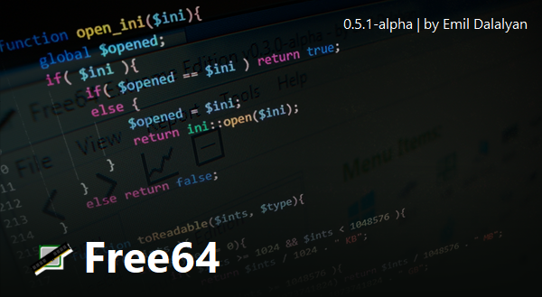

## Free64 Extreme Edition
**Free64** — open source программа, которая показывает информацию о компьютере. Она выложена под [Лицензией MIT](LICENSE).

### Ответы на возможные вопросы

#### Почему первый релиз называется 0.5-alpha
Потому что **последняя версия** PHP Free64 - **0.4.1-beta**

#### Где я могу скачать релизы PHP Free64?
:floppy_disk: **PHP Devel Studio** версии *Free64* могут быть найдены *[здесь](https://github.com/emildalalyan/free64)*.

#### Какие требования у Free64?
  - Windows 7 с **Service Pack 1**
  - **.NET 5** на машине (0.5.1-alpha или выше). Если у вас его нету, то вы можете скачать его *[здесь](https://dotnet.microsoft.com/download/dotnet/5.0)*
  
    **! ВНИМАНИЕ !** Скачивайте .NET 5 **DESKTOP RUNTIME**, не просто **RUNTIME**.
  - Около **10-20 MB** дискового пространства

#### Рекомендуемые требования
  - Microsoft Windows 10 **20H2** или выше.

### Релизы (Где я могу скачать скомпилированную программу?)
:desktop_computer: **Релизы** находятся **[тут](http://github.com/emildalalyan/Free64-Sharp/releases)**

### Скриншоты
Так выглядит **сплеш-скрин** (загрузочный экран):

### Дорожная карта развития
- [ ] Получение температуры ядер процессор(а/ов)
- [ ] Получение температуры GPU (одного или нескольких)
- [ ] Получение скорости работы вентиляторов
- [ ] Чтение SPD оперативной памяти
- [ ] Всевозможные бенчмарки - **[(24.02.2022) В ПРОЦЕССЕ]**
- [ ] Получение названия чипсета мат.платы и названия LPC (мультиконтроллера)
- [ ] Тест стабильности системы (в т.ч отображение троттлинга)
- [ ] Подробная информация о GPU (одном или нескольких)
- [ ] Информация о поддержке разных API видеокарт(ой/ами)
- [ ] Подробная информация о звуков(ой/ых) карт(е/ах)
- [ ] Получение HDD S.M.A.R.T
- [ ] Полностью закончить Free64 CPUID
- [x] Подробная информация о кэше CPU (из CPUID).
- [ ] Написать Free64 Monitor Diagnostics
- [ ] Написать Free64 Keyboard Test
- [ ] Написать HDD Speed Benchmark
- [ ] Написать Cache and Memory Benchmark
- [x] Free64.Information unit-тесты.
- [x] Мульти-поточный сбор информации из WMI и реестра (класс Registry).
- [x] Авто-определение даты сборки.

### Логотип в различных форматах
  | Формат | Ссылка |
  | ------ | ------ |
  | Portable Network Graphics | [free64-logo.png](https://github.com/emildalalyan/free64/blob/master/free64-logo.png?raw=true) |
  | Windows Icon | [free64-logo.ico](https://github.com/emildalalyan/free64/blob/master/free64-logo.ico?raw=true) |
  | Photoshop Document | [free64-logo.psd](https://github.com/emildalalyan/free64/blob/master/free64-logo.psd?raw=true) |
  |||
  | **Gradient** Portable Network Graphics | [free64-gradient-logo.png](https://github.com/emildalalyan/free64/blob/master/free64-gradient-logo.png?raw=true) |
  | **Gradient** Windows Icon | [free64-gradient-logo.ico](https://github.com/emildalalyan/free64/blob/master/free64-gradient-logo.ico?raw=true) |
  | **Gradient** Photoshop Document | [free64-gradient-logo.psd](https://github.com/emildalalyan/free64/blob/master/free64-gradient-logo.psd?raw=true) |

### Донат
:credit_card: Если кто-то хочет **поддержать** *меня* или *мой проект* деньгами, тогда ссылка на *DonationAlerts* [**здесь**](https://donationalerts.com/r/emildalalyan)
